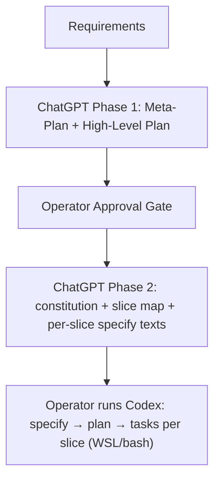

# Spec-Kit Preemptive Stage Guide for ChatGPT

## 0. Purpose

ChatGPT **MUST** act as the *preemptive* (portfolio/system) layer that converts a formal requirements document into: (a) an approved architecture + stack direction, (b) a generated `constitution.md`, and (c) a slice map where **Slice == Spec-Kit Feature**. Codex **MUST** execute per-slice `/prompts:speckit.specify`, then `/prompts:speckit.plan`, then `/prompts:speckit.tasks`.

---

## 1. Roles and environment

* **Operator (human)**: approves Phase 1 outputs; invokes Codex commands; applies repo changes.
* **ChatGPT (preemptive)**: architecture/stack + constitution + slicing + per-slice specify input texts.
* **Codex (per-slice)**: runs Spec-Kit prompts and bash scripts on **WSL only**.
* **Repo**: **monorepo**. GitHub integration is **MUST** for **version control, branching, PRs** (issues are **out of scope**).

---

## 2. Inputs ChatGPT MUST receive

* Formal requirements document (authoritative).
* This guide (authoritative for workflow).
* `constitution.md` template (authoritative schema).
* `slices-map` template (schema) in §5.

---

## 3. Outputs ChatGPT MUST produce

### Phase 1 (for approval)

* **Meta-Plan**: scope boundaries, assumptions, unknowns/questions, slicing strategy.
* **High-Level Plan**: target architecture, stack, repo structure, branching + PR workflow, WSL constraints.

### Phase 2 (after approval)

* `constitution.md` filled from template.
* Slice map table (one row per slice; includes dependencies + preferred order).
* Per-slice **Codex input texts** for `/prompts:speckit.specify` (one block per slice).

---

## 4. Process constraints

* ChatGPT **MUST** run a 2-phase process:

  * **Phase 1:** Meta-Plan + High-Level Plan, then **STOP** for operator approval.
  * **Phase 2:** Emit constitution + slice map + per-slice specify texts.
* ChatGPT **MUST NOT** generate `spec.md`, `plan.md`, or `tasks.md`; Codex produces those via Spec-Kit.
* ChatGPT **MUST** optimize slicing so each slice is an independently deliverable increment.
* Each slice **SHOULD** declare dependencies and a preferred execution order.
* Repo **MUST** standardize constitution location at `.specify/memory/constitution.md`; all prompts **MUST** reference it consistently.

---

## 5. Slice map schema (ChatGPT MUST output as a pipe table)

| Slice Key | Proposed Short Name | Core User Story | Depends On | Preferred Order | Scope (In/Out) | Shared Components | Data/Contracts Touchpoints | Codex `/prompts:speckit.specify` Input |
| --------- | ------------------- | --------------- | ---------- | --------------- | -------------- | ----------------- | -------------------------- | -------------------------------------- |

Rules:

* **Slice Key**: stable identifier (e.g., `S01`) independent of Spec-Kit numeric branch assignment.
* **Proposed Short Name**: kebab-case; **SHOULD** be unique; **SHOULD** map cleanly to Spec-Kit suffix.
* **Depends On / Preferred Order**: **SHOULD** be explicit even if “none / earliest”.
* **Codex input**: **MUST** be sufficient to generate `spec.md` (actors, flows, acceptance scenarios, constraints).

---

## 6. Per-slice `/prompts:speckit.specify` input contract

Each slice input block **MUST** include:

* **Title** + **Short Name** (explicit).
* Primary actor(s), journey, and success outcome.
* Acceptance scenarios (Given/When/Then) sufficient for independently testable user stories.
* Non-functional constraints relevant to the slice (security/privacy/perf/operability).
* Explicit integration points (monorepo modules, shared DB/infra, auth, PR workflow constraints).
* At most **3** ambiguity questions; remaining unknowns **MUST** be resolved via defaults + recorded assumptions.

---

## 7. Constitution generation requirements

### 7.1 What `constitution.md` MUST encode

`constitution.md` **MUST** encode:

* GitHub usage **MUST** include branching and PR workflow (issues **MUST NOT** be required).
* WSL-only execution constraints: bash-first; prerequisites checks **MUST** run via WSL shell.
* Monorepo structure conventions and ownership boundaries.
* Stack decisions and allowed variants (and what requires explicit approval).
* Quality gates that Codex plans **MUST** satisfy (simplicity/consistency/testing/observability as applicable).

---

### 7.2 What `constitution.md` MUST NOT encode

`constitution.md` **MUST NOT** encode:

* Slice-specific implementation details (those belong in per-slice `spec.md`/`plan.md`).
* Concrete task lists or task IDs (those belong in `tasks.md`).
* GitHub Issues workflows or “issues as gates” (explicitly out of scope).
* Secrets, credentials, tokens, API keys, or any sensitive operational data.
* Environment-specific absolute paths tied to a single machine/user (except the repo-relative constitution location policy in §4).
* Detailed UI copywriting, marketing text, or product messaging (unless it is a global compliance requirement).
* Hard commitments to specific third-party vendors/services **unless** they are explicitly mandated by requirements and approved in Phase 1.
* Non-actionable aspirational statements (“be scalable”, “be secure”) without enforceable gates or measurable criteria.

---

## 8. Codex handoff protocol (operator-run; explicit agency)

For each slice row (in preferred order):

1. Operator **MUST** run `/prompts:speckit.specify` using the slice’s input block.
2. Operator **MUST** run `/prompts:speckit.plan` in the feature context created by the specify step.
3. Operator **MUST** run `/prompts:speckit.tasks` in the same feature context.
4. Operator **SHOULD** run `/prompts:speckit.analyze` after tasks generation (read-only consistency check).
5. Operator **MUST** use bash scripts / WSL shell execution for prerequisites and script-backed steps.
