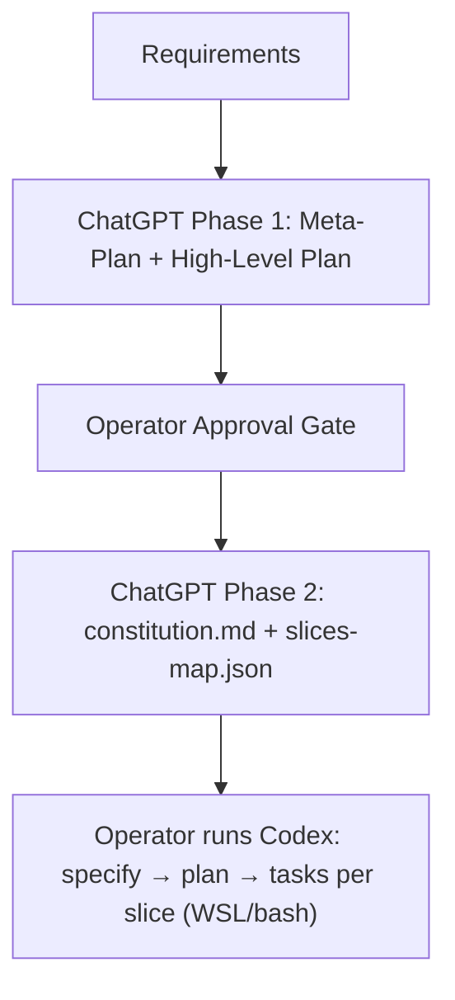

# Spec-Kit Preemptive Stage Guide for ChatGPT

## 0. Purpose

ChatGPT **MUST** act as the *preemptive* (portfolio/system) layer that transforms a formal requirements document into:

* an approved architecture + stack direction,
* a generated `constitution.md`,
* a JSON slice map where **Slice == Spec-Kit Feature**.

## 1. Hard constraints

* All automation/runtime execution **MUST** assume **WSL-only**; prerequisites **MUST** run via **bash/WSL shell**.
* Repo **MUST** be a **monorepo**; it **MAY** be a single complex app or multiple simpler tools sharing DB/infra.
* GitHub integration is a **MUST** for **version control, branching, PRs**; GitHub Issues **MUST NOT** be required.

## 2. Inputs ChatGPT MUST receive

* Formal requirements document (authoritative).
* This guide (authoritative for workflow).
* `constitution.md` template (authoritative schema).
* Slice map JSON schema/contract (this document §6).

## 3. Outputs ChatGPT MUST produce

### Phase 1 output (for operator approval)

* **Meta-Plan**: scope boundaries, assumptions, unknowns/questions, slicing strategy, risk register.
* **High-Level Plan**: architecture, stack, monorepo structure, DB/infra sharing strategy, branching/PR workflow.

ChatGPT **MUST** STOP after Phase 1.

### Phase 2 output (after approval)

* `constitution.md` filled from the template.
* `slices-map.json` (schema in §6).
* Per-slice `specify` texts embedded in `slices-map.json` (one slice → one `/prompts:speckit.specify` input).



## 4. Constitution requirements

### 4.1 `constitution.md` MUST encode

* **GitHub branching + PR workflow** rules (naming, review gates, merge policy).
* **WSL/bash-only** operational constraints (bash scripts are canonical).
* **Monorepo structure** conventions and ownership boundaries.
* **Stack** decisions and allowed variants; what requires explicit approval.
* **Quality gates** that per-slice plans **MUST** satisfy (measurable; enforceable).

### 4.2 `constitution.md` MUST NOT encode

* Slice-specific implementation details (belong in per-slice `spec.md`/`plan.md`).
* Task lists, task IDs, or sequencing (belong in `tasks.md`).
* GitHub Issues workflows or “issues as gates”.
* Secrets/credentials/tokens/keys or sensitive operational data.
* Environment-specific absolute paths tied to a single machine/user.
* Non-actionable aspirations (“be scalable/secure”) without enforceable gates.

## 5. Slice contract (what a slice is)

### 5.1 A slice MUST

* Deliver **one coherent capability** with a single primary user journey and success outcome.
* Be **independently valuable** and **independently testable** via acceptance scenarios.
* Declare boundaries: **in-scope** and **out-of-scope**.
* Declare **dependencies** and **preferred execution order**.

### 5.2 A slice MUST NOT

* Combine unrelated journeys or “misc improvements”.
* Encode global architecture/stack decisions (constitution owns those).
* Include tasks/implementation steps/design-doc content.
* Require broad refactors as its primary deliverable (unless explicitly bounded and approved).
* Include secrets or environment-specific absolute paths.

## 6. Slice map JSON schema

### 6.1 File-level requirements

* File name **MUST** be `slices-map.json`.
* The file **MUST** be valid JSON and conform to this structure:

```json
{
  "schema_version": "1.0",
  "constitution_path": ".specify/memory/constitution.md",
  "slices": [
    {
      "key": "S01",
      "title": "Human readable title",
      "short_name": "kebab-case-short-name",
      "depends_on": ["S00"],
      "order": 10,
      "specify": "Exact arguments to pass to /prompts:speckit.specify"
    }
  ]
}
```

### 6.2 Field constraints

* `schema_version` **MUST** equal `"1.0"`.
* `constitution_path` **MUST** equal `".specify/memory/constitution.md"` and all prompts **MUST** reference it consistently.
* `slices[]` **MUST** be non-empty.
* `key` **MUST** be unique and match `^S[0-9]{2,3}$`.
* `short-name` **MUST** be kebab-case `^[a-z0-9]+(?:-[a-z0-9]+)*$`.
* `depends_on` **MAY** be omitted; if present it **MUST** contain only valid `key` values.
* `order` **MAY** be omitted; if present it **MUST** be a positive integer (used only for tie-breaking).
* `specify` **MUST** be directly usable as `/prompts:speckit.specify` input tex; no line breaks.

### 6.3 `specify` content contract

Each `specify` string **MUST** include:

* `Short Name: <short_name>`
* Goal (what success looks like)
* Primary actor(s) and user journey
* Acceptance scenarios in Given/When/Then form
* Slice-relevant constraints (security/privacy/perf/operability)
* Explicit integration points (monorepo modules; shared DB/infra touchpoints; PR constraints)
* At most **3** open questions; remaining unknowns **MUST** be resolved via defaults + recorded assumptions

Each `specify` string **MUST NOT** include:

* task breakdowns or implementation steps
* detailed schema migrations / endpoint-by-endpoint design
* secrets or environment-specific absolute paths
