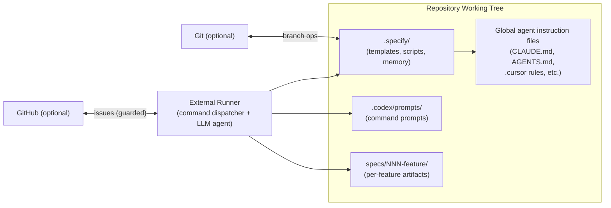
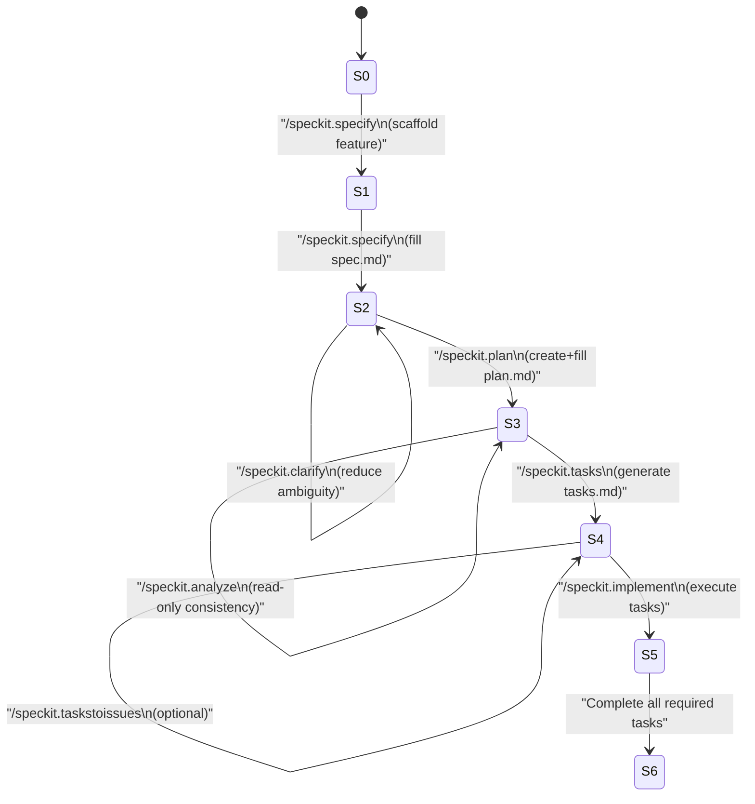

# Spec-Kit System Model Document

**Document ID:** SK-SM-001
**Version:** 1.1
**Date:** 2025-12-23
**Scope:** System model of *spec-kit* (as represented by the provided `spec-kit.zip`) as an SDD workflow scaffold aligned with `spec-driven.md`.

## Version history

| Version | Date       | Changes                                                                                                                                                                                                                                                                          |
| ------- | ---------- | -------------------------------------------------------------------------------------------------------------------------------------------------------------------------------------------------------------------------------------------------------------------------------- |
| 1.0     | 2025-12-22 | Initial model.                                                                                                                                                                                                                                                                   |
| 1.1     | 2025-12-23 | Tightened claims to distinguish **script-enforced** vs **prompt/agent-enforced** behavior; corrected overly-absolute repository invariant; treated constitution path as packaging-dependent; clarified agent context update semantics; clarified planning outputs as MAY/SHOULD. |

---

## 1. Purpose and intent

Spec-kit is a **workflow system** that operationalizes Specification-Driven Development (SDD) by coordinating:

* **Templates** (artifact schemas and quality constraints),
* **Prompts** (command semantics for an LLM agent),
* **Scripts** (repo mechanics, prerequisite validation, and optional agent context updates).

Spec-kit is designed to invert the traditional flow (code-first) into: **spec → plan → tasks → implement**, consistent with SDD’s “specification as the source of truth” framing.

### 1.1 Non-goals

* Spec-kit is **NOT** a complete standalone runner.
* Spec-kit is **NOT** a product codebase; it ships workflow assets, not feature implementations.

---

## 2. System boundary and environment

### 2.1 Boundary statement

Spec-kit **MUST** be used with an external **command runner + LLM agent** capable of:

* loading and executing prompt-defined commands (e.g., `/speckit.plan`),
* reading/writing repository files,
* executing repo-local scripts (bash in this distribution).

The runner is **out of scope** of this distribution.

### 2.2 External dependencies (optional unless stated)

* **Git**: optional, but when present, branch validation and branch creation are active.
* **GitHub**: optional; required only for `/speckit.taskstoissues` (and MUST be guarded by remote URL checks).
* **Agent ecosystems / IDE assistants**: optional; used if you want auto-updated instruction files.

---

## 3. Core concepts and glossary

| Term         | Meaning                                                                                                                                       |
| ------------ | --------------------------------------------------------------------------------------------------------------------------------------------- |
| Feature      | A unit of work keyed by numeric prefix `NNN-...` and a directory under `specs/NNN-.../`.                                                      |
| Artifact     | A structured document representing workflow state: `spec.md`, `plan.md`, `tasks.md`, etc.                                                     |
| Constitution | A governance document defining project-level principles/gates. In this distribution it is a **template scaffold**, not a filled constitution. |
| Command      | A named workflow step represented as a prompt file (`speckit.*.md`) with defined reads/writes/constraints.                                    |
| Runner       | External tool binding `/speckit.*` to prompts and executing scripts/file operations.                                                          |

---

## 4. Architecture model

### 4.1 Component view

### 4.2 Separation of concerns

* **Control plane**: prompts + scripts (define workflow behavior and enforce prerequisites)
* **Data plane**: feature artifacts under `specs/` + governance + optional agent instruction files

---

## 5. Data model

### 5.1 Feature namespace

A feature is represented by:

* **Identifier:** `NNN` (3-digit prefix; base-10)
* **Branch name (git repos):** `NNN-<suffix>`
* **Directory:** `specs/NNN-<something>/`

The feature directory is the canonical store for feature artifacts.

### 5.2 Artifact set and classification

**Required artifacts (by phase):**

* `spec.md` (required after `specify`)
* `plan.md` (required after `plan`)
* `tasks.md` (required after `tasks`, required before `implement`)

**Optional artifacts (planning outputs):**

* `research.md`
* `data-model.md`
* `quickstart.md`
* `contracts/`

**Normative statement:** The planning workflow **SHOULD** produce the optional artifacts when the feature scope implies they are necessary (e.g., API surface → `contracts/`), but spec-kit does not include a script that guarantees their existence; this is primarily **prompt/agent-enforced**.

### 5.3 Canonical path variables (script contract)

Scripts derive and export conceptual variables:

* `REPO_ROOT`, `CURRENT_BRANCH`, `HAS_GIT`
* `FEATURE_DIR`
* `FEATURE_SPEC` = `FEATURE_DIR/spec.md`
* `IMPL_PLAN` = `FEATURE_DIR/plan.md`
* `TASKS` = `FEATURE_DIR/tasks.md`
* `RESEARCH`, `DATA_MODEL`, `QUICKSTART`, `CONTRACTS_DIR`

This set functions as a de facto interface between scripts and prompts.

### 5.4 Plan metadata schema dependency (machine-parsed interface)

`update-agent-context.sh` extracts plan fields from `plan.md` only when they match:

* `**Language/Version**: ...`
* `**Primary Dependencies**: ...`
* `**Storage**: ...`
* `**Project Type**: ...`

**Normative statement:** `plan.md` **MUST** preserve these headings if agent-context updates are expected to work reliably.

---

## 6. Behavioral model (conceptual)

This is a **conceptual** state machine abstraction over prompts + script guards; it is not encoded as a single executable machine.

### 6.1 Per-feature states

* **S0 — NoFeatureContext**: no resolvable active feature
* **S1 — FeatureScaffolded**: `specs/<feature>/spec.md` exists (template copied)
* **S2 — SpecReady**: `spec.md` populated sufficiently for planning
* **S3 — PlanReady**: `plan.md` exists and is populated; optional design docs may exist
* **S4 — TasksReady**: `tasks.md` exists and is dependency-ordered
* **S5 — Implementing**: tasks being executed
* **S6 — Implemented**: completion criteria met (project-defined)

### 6.2 Command transitions

---

## 7. Command semantics model (normative vs implemented)

### 7.1 Important distinction

* **Script-enforced behavior**: prerequisites, path resolution, branch validation, template copying, agent-file section insertion.
* **Prompt/agent-enforced behavior**: “gate evaluation”, constitution propagation, design artifact richness, and implementation discipline.

The system **MUST NOT** assume that prompt-enforced steps are automatically executed unless the runner ensures they are.

### 7.2 Command definitions

| Command                  | Scripted mechanics (implemented)                                             | Prompt/agent responsibilities (not hard-automated here)                                         |
| ------------------------ | ---------------------------------------------------------------------------- | ----------------------------------------------------------------------------------------------- |
| `/speckit.specify`       | Create branch/dir, copy spec template.                                       | Fill spec sections; cap `[NEEDS CLARIFICATION]` markers; produce testable stories/requirements. |
| `/speckit.clarify`       | Resolve paths (paths-only mode).                                             | Identify ambiguity; write clarifications back into `spec.md`.                                   |
| `/speckit.plan`          | Copy plan template to `plan.md`; optionally update agent context via script. | Fill technical context, research, design artifacts; record gate outcomes per constitution.      |
| `/speckit.tasks`         | Validate feature dir + plan existence; enumerate optional docs present.      | Generate dependency-ordered tasks grouped by user story; mark parallelizable tasks.             |
| `/speckit.analyze`       | None (read-only).                                                            | Cross-artifact consistency report; identify gaps/duplication/conflicts.                         |
| `/speckit.checklist`     | Validate feature context.                                                    | Generate requirement-quality checklist(s) (not implementation tests).                           |
| `/speckit.implement`     | Validate tasks existence; include tasks path.                                | Execute tasks in order; honor checklists if present; produce code changes.                      |
| `/speckit.taskstoissues` | Validate tasks existence; provide tasks path.                                | Verify GitHub remote; create issues; refuse if remote mismatch.                                 |
| `/speckit.constitution`  | None in scripts (in this kit).                                               | Update constitution and propagate implications into dependent artifacts.                        |

---

## 8. Script operational model

### 8.1 Feature context resolution

Resolution precedence:

1. `SPECIFY_FEATURE` environment variable (if set)
2. git current branch name (if git detected)
3. fallback to highest-numbered `specs/NNN-*` directory
4. final fallback value (e.g., `"main"`) in non-git/no-specs conditions

**Normative statement:** Runners **SHOULD** ensure a valid feature exists before running commands that require it; fallbacks like `"main"` are not guaranteed to correspond to a valid feature directory and will fail later with clearer errors.

### 8.2 Prerequisite validation

`check-prerequisites.sh` supports:

* required presence checks (`plan.md`, optionally `tasks.md`)
* discovery of optional docs for tasks generation
* JSON output to enable prompt-driven path binding

### 8.3 Agent context update behavior (tightened)

`update-agent-context.sh`:

* parses `plan.md` metadata (Section 5.4),
* derives a technology stack entry and recent change entry for the current branch,
* updates or creates agent instruction files.

**Corrected claim:** The script updates **targeted sections** (not a full regeneration) and generally leaves other content untouched. It does not rely on “manual additions markers” as hard update boundaries; it uses section detection for “Active Technologies” and “Recent Changes” and updates timestamps where matched.

---

## 9. Invariants and contracts (RFC 2119)

### 9.1 Repository invariants

* In git repos, the current branch name **MUST** match `^[0-9]{3}-` to be treated as a feature branch.
* Feature directories **MUST** reside under `specs/`.
* Feature-specific artifacts (`spec.md`, `plan.md`, `tasks.md`, and planning outputs) **MUST** reside within `specs/<feature>/`.
* Global governance and global agent instruction files **MAY** reside outside feature directories (e.g., `CLAUDE.md`, `AGENTS.md`, `.cursor/...`).

### 9.2 Artifact interface invariants

* If agent context updates are desired, `plan.md` **MUST** include machine-parsable bold-field lines (Section 5.4).
* `tasks.md` **SHOULD** preserve dependency ordering semantics expressed by the tasks template (tests → models → services → endpoints).

### 9.3 Workflow ordering invariants

* `/speckit.tasks` **MUST** require `plan.md` existence.
* `/speckit.implement` **MUST** require `tasks.md` existence.
* `/speckit.analyze` **MUST** be read-only.

---

## 10. Failure modes and recovery strategies

### 10.1 Primary failure modes

* Not on `NNN-...` branch (git repos): guard failure.
* Feature directory missing: guard failure; must scaffold via `specify`.
* `plan.md` missing: tasks cannot proceed.
* `tasks.md` missing: implement cannot proceed.
* Plan fields missing: agent context update becomes incomplete or generic.
* Multiple `specs/NNN-*` matches: prefix resolution emits error and may select a fallback path.

### 10.2 Recovery strategies

* Recover by re-running the preceding command (specify → plan → tasks), not by patching downstream artifacts first.
* Use clarify before plan when ambiguity materially affects planning.
* Run analyze after tasks generation to detect divergence before implementation.

---

## 11. Governance model (constitution) — corrected

### 11.1 Authority

The constitution is intended to be the highest-level constraint mechanism in the workflow (principles, gates, review standards). This aligns with SDD’s constraint-driven approach to avoid uncontrolled complexity.

### 11.2 Location is packaging-dependent

This distribution includes `.specify/memory/constitution.md` as a template scaffold. Some command definitions reference `/memory/constitution.md`. Therefore:

* The constitution path **MUST** be treated as configurable/packaging-dependent.
* Runners/integrators **SHOULD** standardize on one path and ensure prompts reference it consistently.

---

## 12. Extensibility model

### 12.1 Adding a new command

A new command:

* **MUST** declare its preconditions (which artifacts exist),
* **MUST** define reads/writes,
* **SHOULD** integrate into the per-feature state model as a transition.

### 12.2 Adding an agent ecosystem target

To add support:

* map `agent_type` → `target_file`,
* add a case entry for that type,
* ensure the file path is writable in the repository context.

### 12.3 Safe template changes

Because templates are interfaces:

* Changes to plan field headings **MUST** be accompanied by parser changes.
* Changes to feature directory layout **MUST** be accompanied by path resolution + prerequisite script changes.

---

## Appendix A — Command transition matrix

| Command       | Requires              | Reads                                          | Writes                             | Side effects                   |
| ------------- | --------------------- | ---------------------------------------------- | ---------------------------------- | ------------------------------ |
| specify       | none                  | templates                                      | `specs/<feature>/spec.md`          | git branch creation (optional) |
| clarify       | feature context       | `spec.md`                                      | `spec.md`                          | none                           |
| plan          | `spec.md`             | `spec.md`, constitution, templates             | `plan.md` (+ optional design docs) | agent-file update (optional)   |
| tasks         | `plan.md`             | `plan.md` (+ optional docs)                    | `tasks.md`                         | none                           |
| analyze       | typically tasks-ready | `spec.md`, `plan.md`, `tasks.md`, constitution | none                               | none                           |
| checklist     | feature context       | artifacts                                      | checklist file(s)                  | none                           |
| implement     | `tasks.md`            | `tasks.md` (+ checklists optional)             | code changes                       | none inherent                  |
| taskstoissues | `tasks.md`            | `tasks.md`, git remote                         | none                               | GitHub issues (guarded)        |
| constitution  | repo context          | constitution                                   | constitution (+ downstream edits)  | none                           |

---

## Appendix B — Known packaging gaps (explicit)

* Some prompts reference a PowerShell prerequisite script path that is not present in this distribution; bash scripts are present and appear to be the primary implementation.
* `.specify/templates/commands/*.md` front matter uses shorter relative paths (e.g., `scripts/bash/...`) that do not exist verbatim in this zip; `.codex/prompts` uses `.specify/...` explicitly. A runner **MUST** account for this mapping.

---

If you want, I can also provide a “compliance checklist” that you can use to validate a repository has been wired correctly for spec-kit (runner integration, path mapping, constitution standardization, and script execution assumptions).
